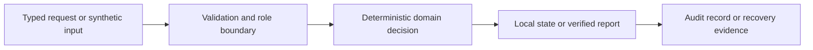

# Architecture and review guide

## Core workflow

Validate callback signatures and event IDs, match exact integer-cent balances and retain exceptions. Reviewer proposals require explicit approval and cannot overdraw a changed balance.

## What to review

1. Request validation before state changes.
2. Role or tenant permissions on protected actions.
3. Duplicate, stale-version and failure handling.
4. Deterministic outputs and an inspectable audit or report.
5. Tests that exercise conflicting requests and failure paths.

## Implementation boundary

This is independent showcase code with synthetic data. Runtime requirements, shared modules and actual storage are documented in the parent stack README. External database, broker, identity, cloud and model integrations from broader project descriptions are not represented as deployed services. Local fixtures deliberately make the core workflow easy to review without an external account.
